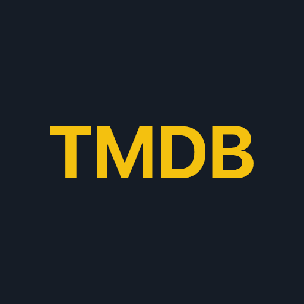
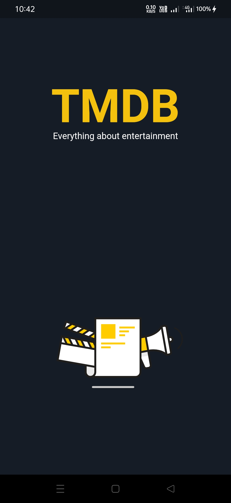
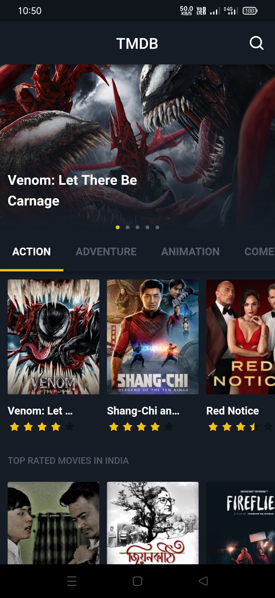
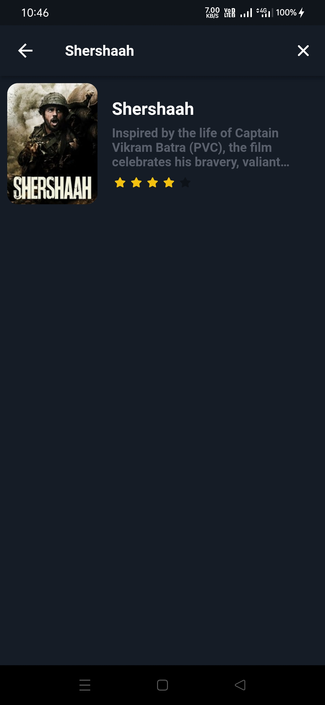
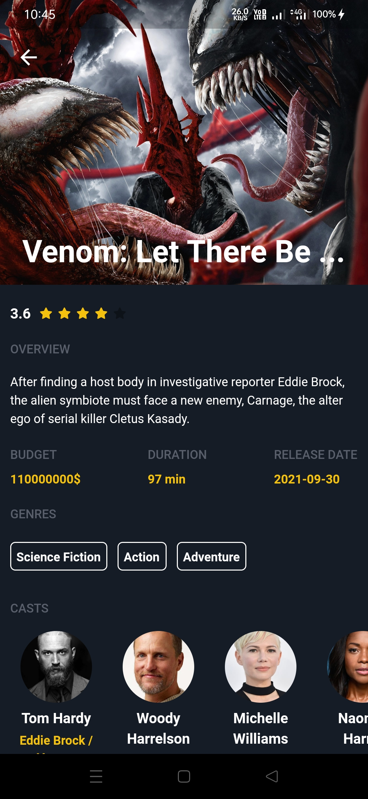
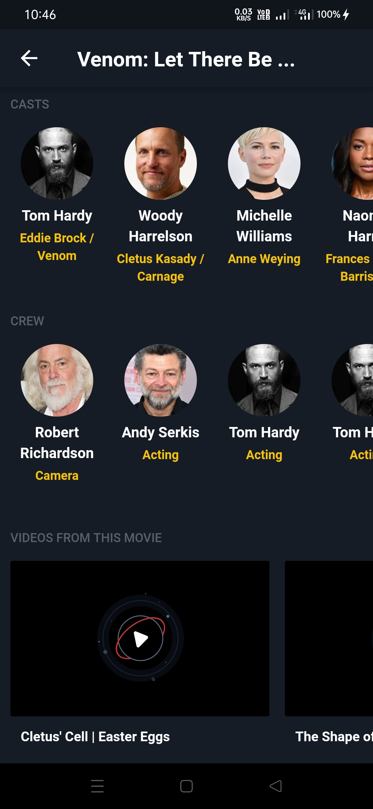
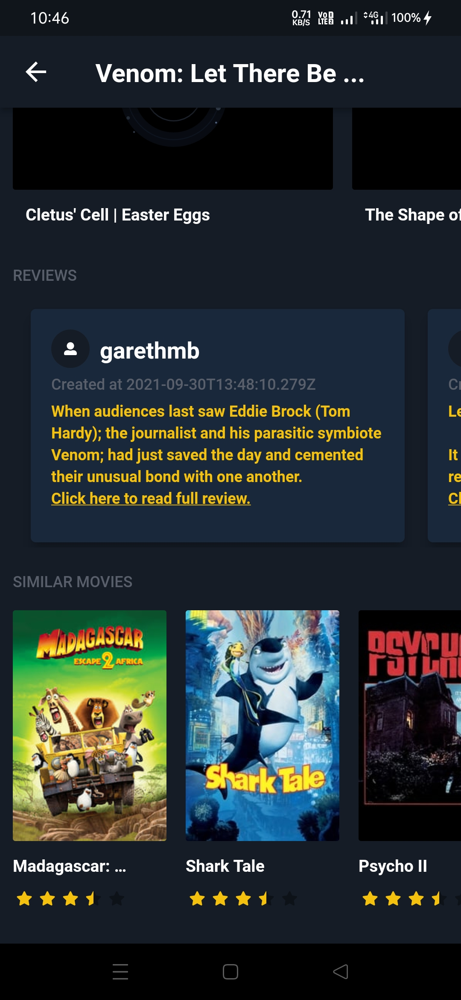
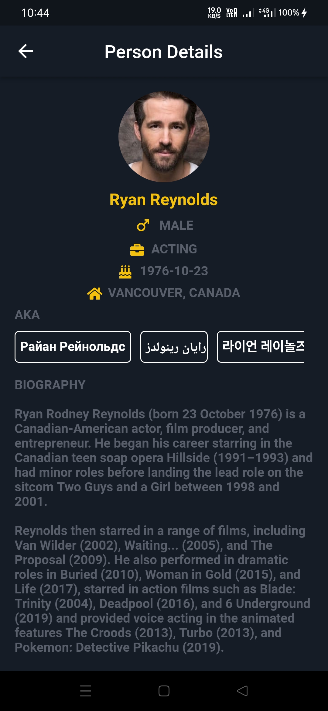

# TMDB APP

An app that shows information about a movie.

## App Icon

## Packages used

-dio: ^4.0.3
-bloc: ^8.0.1
-rxdart: ^0.27.2
-eva_icons_flutter: ^3.0.2
-flutter_rating_bar: ^4.0.0
-page_indicator: ^0.4.1
-font_awesome_flutter: ^9.2.0
-sliver_header_delegate: ^0.0.1
-get: ^4.3.8
-url_launcher: ^6.0.15
-lottie: ^1.2.1

## Screenshots
|------|-------|
|||
|||
|||
||

## Download
APK can be found [here][1]

## API Details
The API used in this application is from TMDB. Can be found [here][2]

## Author
Rajit Deb

## Find me on

[1]: https://github.com/rajitdeb/TMDB-App/assets/app-debug.apk
[2]: https://www.themoviedb.org/documentation/api

