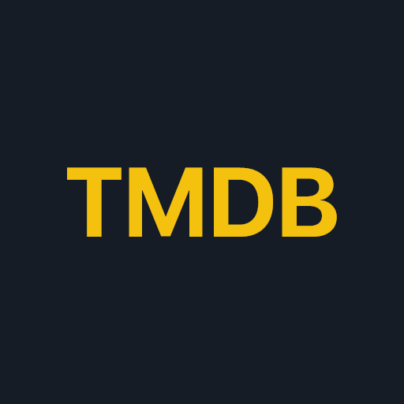
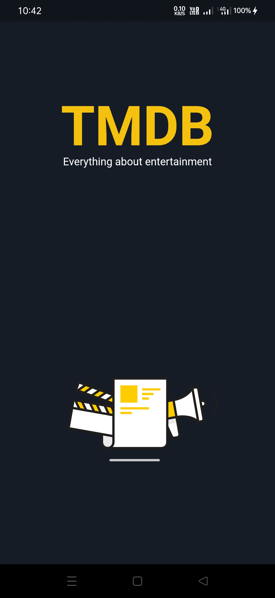
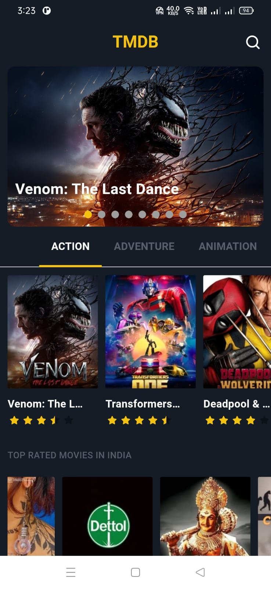
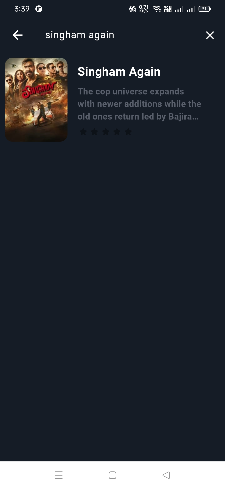
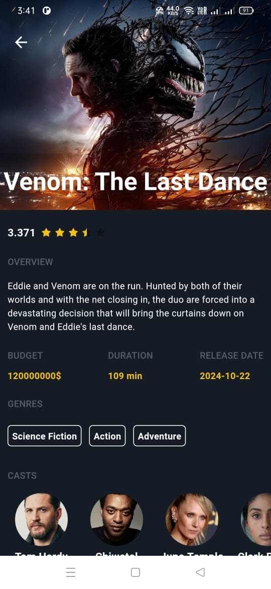
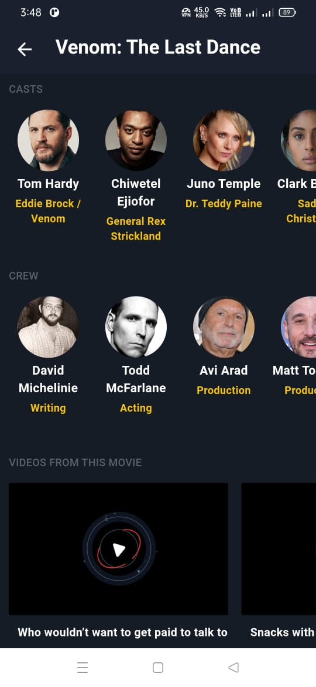
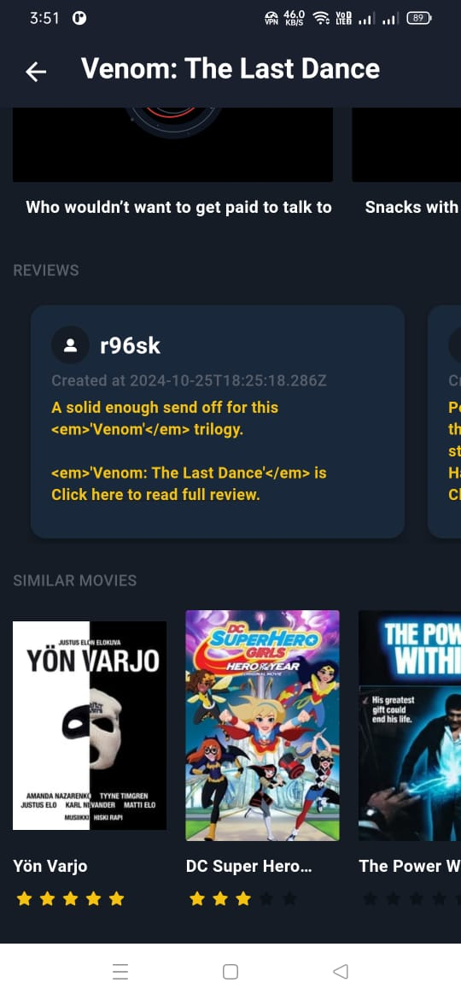
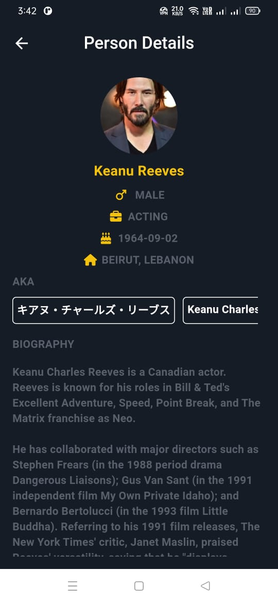
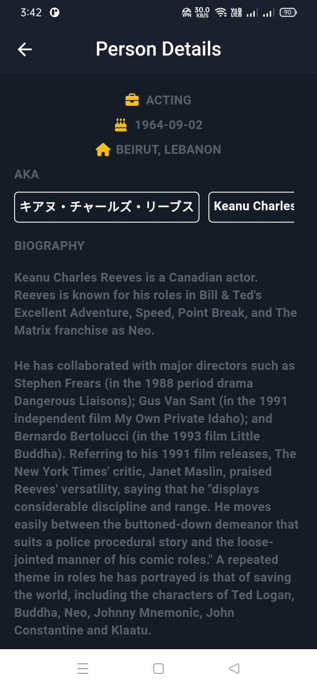

# TMDB APP
An app that shows information about new and upcoming movies & TV series alongside cast, crew and other vital information.

## App Icon

## Screenshots
| Screenshot 1                               | Screenshot 2                                 | Screenshot 3                                 |
|--------------------------------------------|----------------------------------------------|----------------------------------------------|
|   |    |  |
| Screenshot 4                               | Screenshot 5                                 | Screenshot 6                                 |
|  |    |    |
| Screenshot 7                               |
|  |  |

## Packages used

| Package Name            | Release No. |
|-------------------------|-------------|
| dio:                    | ^5.7.0      |
| bloc:                   | ^8.1.4      |
| rxdart:                 | ^0.28.0     |
| eva_icons_flutter:      | ^3.1.0      |
| flutter_rating_bar:     | ^4.0.1      |
| smooth_page_indicator:  | ^1.2.0+3      |
| font_awesome_flutter:   | ^10.7.0      |
| sliver_header_delegate: | ^0.0.5      |
| get:                    | ^4.6.6      |
| url_launcher:           | ^6.3.1     |
| lottie:                 | ^3.1.3     |

## How to get started with the repo ?
1. Clone the repo.  
2. Then go to [this][2] link and register for an API Key.  
3. Go to `constants.dart` under `utils` folder in the `lib` directory.  
4. Paste your api key in the `YOUR_API_KEY` field.

## Download
APK can be found [here][1]

## API Details
The API used in this application is from TMDB. Can be found [here][2]

## Author
<b>Rajit Deb</b>

## Find me on

[1]: https://github.com/rajitdeb/TMDB-App/blob/11-Final-Project/assets/apk/app-release.apk?raw=true
[2]: https://www.themoviedb.org/documentation/api

